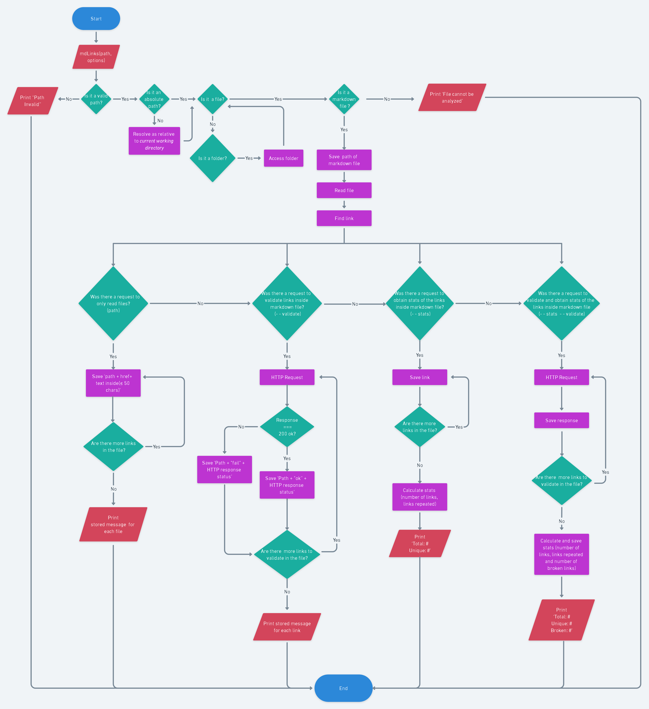
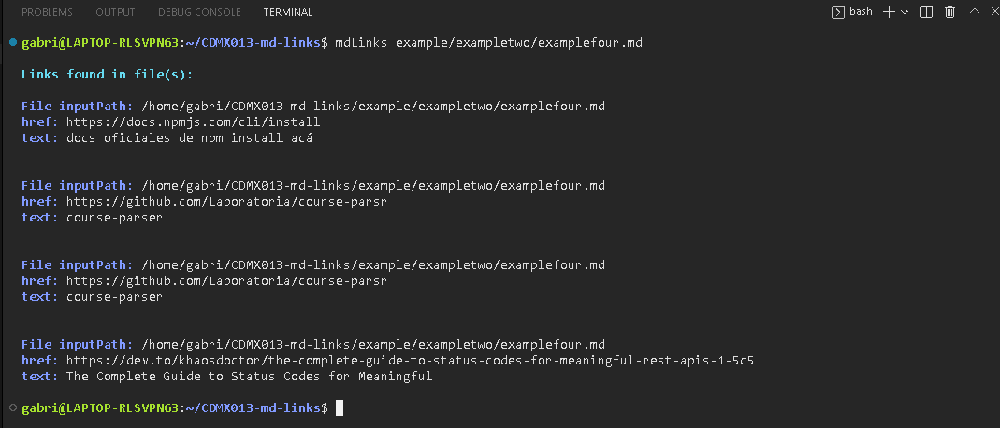
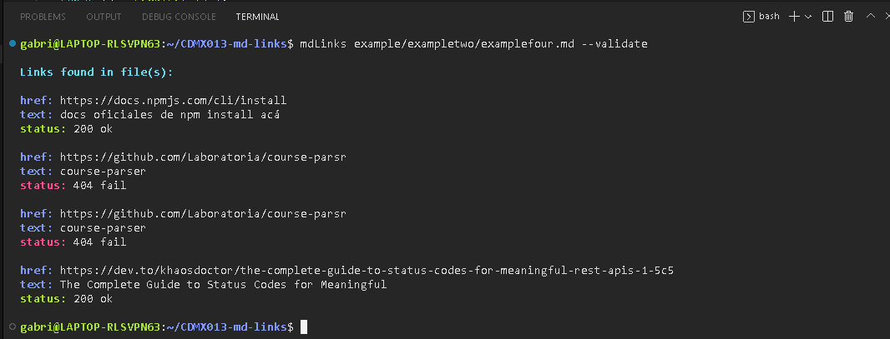
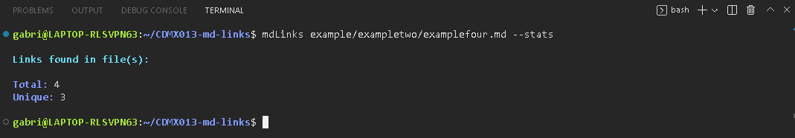
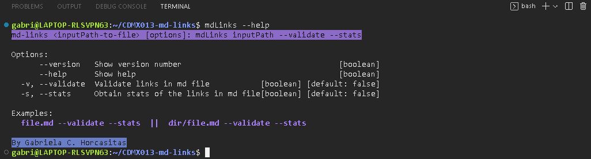
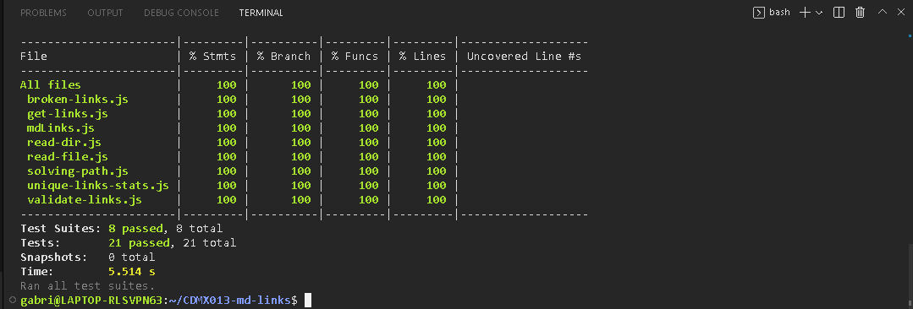

# Markdown Links

## Índice

* [1. Preámbulo](#1-preámbulo)
* [2. Resumen del proyecto](#2-resumen-del-proyecto)
* [3. Planificación](#3-planificación)
* [4. Instalación](#4-instalación)
* [5. Implementación](#5-implementación)
* [6. Test Unitarios](#6-test-unitarios)

***

## 1. Preámbulo

[Markdown](https://es.wikipedia.org/wiki/Markdown) es un lenguaje de marcado
ligero muy popular entre developers. Es usado en muchísimas plataformas que
manejan texto plano (GitHub, foros, blogs, ...) y es muy común
encontrar varios archivos en ese formato en cualquier tipo de repositorio
(empezando por el tradicional `README.md`).

Estos archivos `Markdown` normalmente contienen _links_ (vínculos/ligas) que
muchas veces están rotos o ya no son válidos y eso perjudica mucho el valor de
la información que se quiere compartir.

## 2. Resumen del proyecto

Se creó una librería en JavaScript que lee archivos en formato Markdown,
a partir de lo cual puede verificar, meditante peticiones HTTP, 
los links contenidos en estos archivos y repotar 
información relevante acerca de los mismos, por ejemplo, 
el total de links y si estos son válidos, están repetidos o rotos.

Esta API emplea como dependencias: 

* [Axios](https://www.npmjs.com/package/axios)
* [Cheerio](https://www.npmjs.com/package/cheerio)
* [Marked](https://www.npmjs.com/package/marked)

Para la ejecución de esta libreria, denominada mdLinks, también se creó una
herramienta de línea de comando (CLI), que acepta por argumentos las 
opciones de validar y/o obtener estadísticas de los links en cuestión.

Para el CLI se usan las dependencias:

* [Colors](https://www.npmjs.com/package/colors)
* [Yargs](https://www.npmjs.com/package/yargs)

## 3. Planificación

Como punto de partida para el desarrollo de este proyecto, se itero sobre
un [diagrama de flujo](https://whimsical.com/mdlinks-flowchart-GTqMzobjxnmCcLD28m5SHQ)
 que fue creado contemplando los elementos mínimos
necesarios a cubrir por la API.

## 4. Instalación

`npm install `

## 5. Implementación

La librería mdLinks se ejecuta y recibe argumentos desde la linea de comando
(CLI):  _mdLinks_ _path_ _options_

El argumento path hace referencia a la ruta del _archivo markdown_ o 
_directorio que contiene archivos markdown_, _este argumento es obligatorio._ 

Mientras que options hace referencia, como su nombre lo
indica, a los argumentos opcionales de validación y/o estadísticas de 
los links contenidos en el archivo markdown.

* _mdLinks_ _path_ _--validate_
* _mdLinks_ _path_ _--stats_
* _mdLinks_ _path_ _--validate --stats_

Como un elemento de apoyo, se incluyo como argumento _--help_ en la
línea de comando. Si se usa se despliega un resumen de la forma del objetivo
y forma de uso de la libreria (_mdLinks_ _path_ _--help_).

A continuación algunos ejemplos de la visualización de estas diferentes
opciones:

### mdLinks path !options 

### mdLinks path --validate

### mdLinks path --stats

### mdLinks path --validate --stats

### mdLinks --help

## 6. Test Unitarios

Con la finalidad de verificar el correcto funcionamientode la API y procurar 
su optimización, se desarrollaron e implementaron test unitarios 
de las diferentes funciones que componen a la librería.

