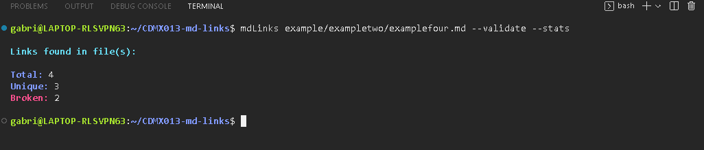

# Markdown Links

## Índice

* [1. Preamble](#1-preamble)
* [2. Project Summary](#2-project-summary)
* [3. Planning](#3-planning)
* [4. Installation](#4-installation)
* [5. User Manual](#5-user-manual)
* [6. Unit Tests](#6-unit-tests)

***

## 1. Preamble

[Markdown](https://es.wikipedia.org/wiki/Markdown) is a markup language
very popular among developers. It's used in many platforms that
handle plain text (GitHub, forums, blogs, ...) and it's very common to
find multiple files in that format in any kind of repository
(starting with the traditional `README.md`).

These `Markdown` files usually contain _links_ that
many times are broken or are no longer valid. This greatly damages the value of
the information you want to share.

## 2. Project Summary

I developed a JavaScript library that reads files in Markdown format,
from which it can be verified, through HTTP requests,
if the links contained in these files are valid and report
relevant information about them, for example,
the total number of links and if they'r repeated or broken.

This API uses as dependencies:

* [Axios](https://www.npmjs.com/package/axios)
* [Cheerio](https://www.npmjs.com/package/cheerio)
* [Marked](https://www.npmjs.com/package/marked)

For the execution of this library, called mdLinks, I developed a
command line tool (CLI), which accepts as arguments the
options to validate and/or obtain statistics of the links in question.

For the CLI the dependencies are used:

* [Colors](https://www.npmjs.com/package/colors)
* [Yargs](https://www.npmjs.com/package/yargs)

## 3. Planning

As a starting point for the development of this project, I iterated on
a [flowchart](https://whimsical.com/mdlinks-flowchart-GTqMzobjxnmCcLD28m5SHQ)
that was created contemplating the minimum elements
necessary to cover by the API.

## 4. Installation

`npm i md-links-gchm` and configure an alias for the cli execution

or

`npm i -D md-links-gchm` and then run with `npx mdlinks [options]`

Whereas to import the module with CommonJS Modules use `require/module.exports`.

## 5. User Manual

The mdLinks library is executed and receives arguments from the command line
(CLI): _mdLinks_ _path_ _options_

The path argument refers to the path of the _markdown_ file or the
_directory containing markdown files_, _this argument is required._

While options refers to the optional arguments of validation and/or statistics of
the links contained in the markdown.

* _mdLinks_ _path_ _--validate_
* _mdLinks_ _path_ _--stats_
* _mdLinks_ _path_ _--validate --stats_

As a support element, I included as an argument _--help_ in the
command line. If used, a summary of how to use the library  is displayed (_mdLinks_ _path_ _--help_).

Here are some examples of the visualization of these different
options:

### mdLinks path !options 

### mdLinks path --validate

### mdLinks path --stats

### mdLinks path --validate --stats

### mdLinks --help

## 6. Unit Tests

In order to verify the correct functioning of the API and to procure
its optimization, unit tests were developed and implemented
of the different functions that make up the library.

